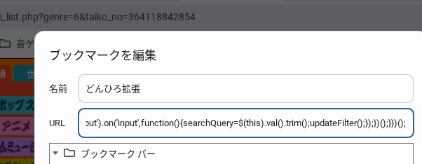
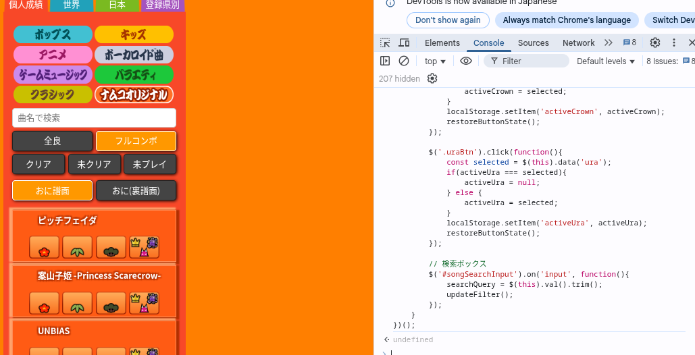
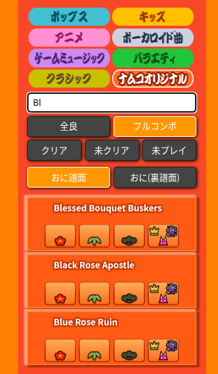

# donder-hiroba-plugin
どんだーひろばのスコアリストページでフィルターボタン、検索ボックスを追加するためのスクリプトです。  
リロードすると消えるので再実行するようにしてください(選択したボタンは記憶するようにしてます)  
- サポートサーバー  

## 使い方
一応スマホでもPCでも使えます！ブックマークレットの登録がちょっとややこしいですが、手順リンク貼っておきます
### スマホの人向け
- スマホの人はブックマークレットのほうでのみ実行できます。  
まずドンだーひろばを開いてブックマークします。  
そしたらブックマークを編集してURLの部分をdonder-hiroba-bl.jsの内容に置き換えてください。  
それが完了したら[スコアリスト画面](https://donderhiroba.jp/score_list.php)でブックマークレットを押して実行すればできます。  
- Androidの人のブックマークレット作成方法  
https://hep.eiz.jp/article/android-bookmarklet/    
https://www.youtube.com/watch?v=5n7HbjvnG8U  
- iphoneの人のブックマークレット作成方法  
https://hep.eiz.jp/article/iphone-bookmarklet/    
https://www.youtube.com/shorts/gSjTsXi5JFk  
### PCの人向け
- ブックマークレットで実行する場合(簡単だしオススメ)  
まずdonder-hiroba-bl.jsの内容をコピーしてブックマークレットとして登録しておきます。  
ドンだーひろばの[スコアリスト画面](https://donderhiroba.jp/score_list.php)でブックマークレットを押して実行するだけです。  
  
  
- コンソールで実行する場合  
まずドンだーひろばの[スコアリスト画面](https://donderhiroba.jp/score_list.php)で`ctrl + shift + i`をして開発者ツールを開きます  
次にdonder-hiroba-cl.jsの内容をコピーしてそこに貼り付けます。  
Enterを押して実行してください  
  

## 機能
- 全良 / フルコンボ / クリア / 未クリア / 未プレイでの絞り込み検索  
- おにのみ、裏譜面のみの表示設定  
- 曲名検索  

> [!WARNING]
> ドンだー広場の仕様変更により動作しなくなる可能性があります